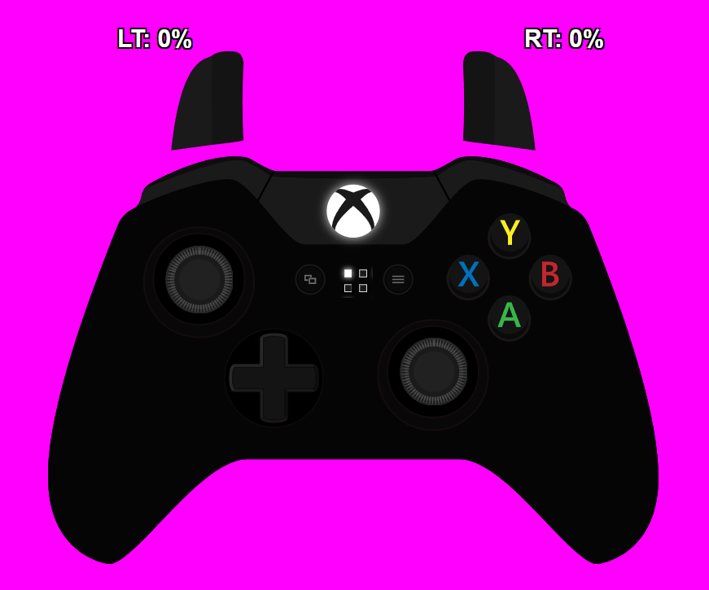

# Gamepad Viewer

## Описание
Этот проект позволяет отслеживать нажатия кнопок и стиков на различных геймпадах, таких как Xbox One, Xbox 360, PS3, PS4, GameCube, FightPad Pro, Fight Stick, NES, Nintendo 64, и выводить их в веб-интерфейс. Интерфейс можно захватывать с помощью OBS для стриминга или записи видео. Поддерживаются все кнопки и оси геймпада.

## Требования
- Python 3
- Flask
- XInput-Python

## Установка

1. Клонируйте репозиторий:
    ```sh
    git clone https://github.com/yourusername/gamepad_viewer.git
    cd gamepad_viewer
    ```

2. Установите необходимые зависимости:
    ```sh
    pip install flask XInput-Python
    ```

## Запуск

### Команда для запуска:

```sh
python3 gamepad_viewer.py [ip] [port] [player_id]
```

### Примеры запуска:
- Локально (127.0.0.1:5000):
    ```sh
    python3 gamepad_viewer.py
    ```

- Указать IP и порт (например, для доступа из локальной или удаленной сети):
    ```sh
    python3 gamepad_viewer.py 0.0.0.0 5000
    ```

- Указать player_id (если не указан, номер игрока будет определен автоматически):
    ```sh
    python3 gamepad_viewer.py 0.0.0.0 5000 1
    ```

### Альтернативный запуск
Вы также можете скачать релиз с GitHub и запустить сервер без установки Python и зависимостей:

1. Скачайте архив [gamepad_viewer.zip](https://github.com/yourusername/gamepad_viewer/releases/latest).
2. Распакуйте архив.
3. Запустите `gamepad_viewer.bat` (в нем можно отредактировать адрес, на котором будет запущен сервер).

## Использование с OBS

1. Запустите скрипт, например:
    ```sh
    python3 gamepad_viewer.py
    ```

2. Откройте веб-браузер и перейдите по адресу, где запущен скрипт, например:
    ```
    http://127.0.0.1:5000
    ```

3. Выберите геймпад, кликнув в любое место и выбрав скин геймпада.

4. Скопируйте URL из адресной строки браузера.

5. В OBS нажмите кнопку "+" для добавления нового источника и выберите "Браузер".

6. Вставьте скопированный URL в поле "URL", укажите разрешение (например, 1920x1080) и нажмите "ОК".

7. Разместите виджет на экране.

### Смена скина геймпада

Кликните в любую область на экране, чтобы открыть модальное окно, где вы можете выбрать скин геймпада. 

## Пример работы скрипта



# Gamepad Viewer

## Description
This project allows tracking button presses and stick movements on various gamepads, such as Xbox One, Xbox 360, PS3, PS4, GameCube, FightPad Pro, Fight Stick, NES, Nintendo 64, and displaying them in a web interface. The interface can be captured using OBS for streaming or recording videos. All buttons and axes of the gamepad are supported.

## Requirements
- Python 3
- Flask
- XInput-Python

## Installation

1. Clone the repository:
    ```sh
    git clone https://github.com/yourusername/gamepad_viewer.git
    cd gamepad_viewer
    ```

2. Install the required dependencies:
    ```sh
    pip install flask XInput-Python
    ```

## Running

### Command to run:

```sh
python3 gamepad_viewer.py [ip] [port] [player_id]
```

### Examples of running:
- Locally (127.0.0.1:5000):
    ```sh
    python3 gamepad_viewer.py
    ```

- Specify IP and port (e.g., for access from local or remote network):
    ```sh
    python3 gamepad_viewer.py 0.0.0.0 5000
    ```

- Specify player_id (if not specified, the player number will be determined automatically):
    ```sh
    python3 gamepad_viewer.py 0.0.0.0 5000 1
    ```

### Alternative Launch
You can also download the release from GitHub and run the server without installing Python and dependencies:

1. Download the archive [gamepad_viewer.zip](https://github.com/yourusername/gamepad_viewer/releases/latest).
2. Extract the archive.
3. Run `gamepad_viewer.bat` (you can edit the address in it where the server will run).

## Using with OBS

1. Run the script, for example:
    ```sh
    python3 gamepad_viewer.py
    ```

2. Open a web browser and navigate to the address where the script is running, for example:
    ```
    http://127.0.0.1:5000
    ```

3. Select the gamepad by clicking anywhere and choosing a gamepad skin.

4. Copy the URL from the browser's address bar.

5. In OBS, click the "+" button to add a new source and select "Browser".

6. Paste the copied URL into the "URL" field, set the resolution (e.g., 1920x1080), and click "OK".

7. Position the widget on the screen.

### Changing the gamepad skin

Click anywhere on the screen to open a modal window where you can select the gamepad skin.

## Example of Script in Action


